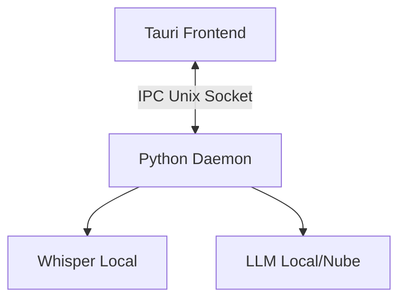

# 🗣️ Voice2Machine (V2M)

> **Dictado por Voz Local y Refinado de Texto**
> *State of the Art 2026 - Privacidad Primero - Acelerado por GPU*

---

## 🚀 Resumen

**Voice2Machine** te permite dictar texto en **cualquier aplicación** de tu sistema operativo. Utiliza tu GPU local para transcribir audio con la máxima velocidad y precisión, asegurando que tus datos nunca salgan de tu máquina.

*   **Dictado**: Voz → Texto (Whisper)
*   **Refinado**: Texto → IA → Texto Mejorado (LLM)

---

## 📚 Documentación

Mantenemos documentación completa en Inglés y Español.

*   🇪🇸 **[Documentación en Español](docs/docs/es/index.md)**
*   🇺🇸 **[English Documentation](docs/docs/en/index.md)**

### Enlaces Rápidos

| Tema | Español | Inglés |
| :--- | :--- | :--- |
| **Empieza Aquí** | [Guía Rápida](docs/docs/es/guia_rapida.md) | [Quick Start](docs/docs/en/quick_start.md) |
| **Instalación** | [Instalación](docs/docs/es/instalacion.md) | [Installation](docs/docs/en/installation.md) |
| **Configuración** | [Configuración](docs/docs/es/configuracion.md) | [Configuration](docs/docs/en/configuration.md) |
| **Diseño** | [Arquitectura](docs/docs/es/arquitectura.md) | [Architecture](docs/docs/en/architecture.md) |

---

## ⚡ Inicio Rápido

### Instalación

```bash
# Clonar e instalar (Ubuntu/Debian)
git clone https://github.com/v2m-lab/voice2machine.git
cd voice2machine
./scripts/install.sh
```

### Uso

1.  **Iniciar el Demonio**: `python -m v2m.main --daemon`
2.  **Alternar Grabación**: Ejecuta `scripts/v2m-toggle.sh` (Vincula esto a una tecla como `Super+V`).

---

## 🧩 Arquitectura

Voice2Machine sigue una **Arquitectura Hexagonal** con una estricta separación entre el Backend en Python (Lógica central) y el Frontend en Tauri (GUI).



---

## 📄 Licencia

Este proyecto está licenciado bajo la **GNU General Public License v3.0**.
