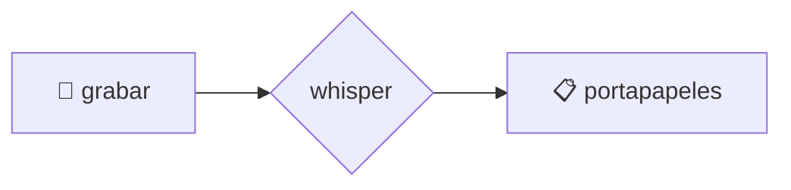
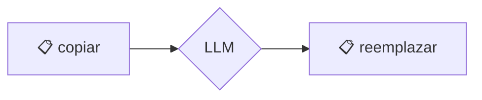

# 🗣️ voice2machine

_dictado por voz para cualquier campo de texto en tu sistema operativo_

---

## qué es esto

Una herramienta que convierte tu voz en texto usando tu GPU local.

La premisa es simple: hablar es más rápido que escribir. Este proyecto te permite dictar en cualquier aplicación sin depender de servicios en la nube.

---

## filosofía

- **local-first**: tu audio nunca sale de tu máquina
- **modular**: empezó como un script, ahora es una aplicación con responsabilidades separadas
- **gpu-powered**: velocidad de transcripción usando WHISPER localmente

---

## cómo funciona

El sistema corre como un **Daemon en segundo plano** que expone una **API REST FastAPI** en `localhost:8765`.

| componente  | rol                                                                                       |
| ----------- | ----------------------------------------------------------------------------------------- |
| `daemon`    | Maneja grabación de audio, transcripción Whisper, y procesamiento LLM vía endpoints REST. |
| `shortcuts` | Atajos de teclado globales que envían requests HTTP al daemon.                            |

---

## documentación

Toda la información técnica está en `/docs`:

- [instalación](docs/docs/es/instalacion.md)
- [arquitectura](docs/docs/es/arquitectura.md)
- [configuración](docs/docs/es/configuracion.md)
- [atajos de teclado](docs/docs/es/atajos_teclado.md) ⌨️
- [troubleshooting](docs/docs/es/troubleshooting.md)

---

## flujos visuales

### voz → texto

### texto → texto mejorado

> si no ves los diagramas, necesitas una extensión de mermaid

---

## licencia

Este proyecto está licenciado bajo **GNU General Public License v3.0** - ver el archivo [LICENSE](LICENSE) para más detalles.
