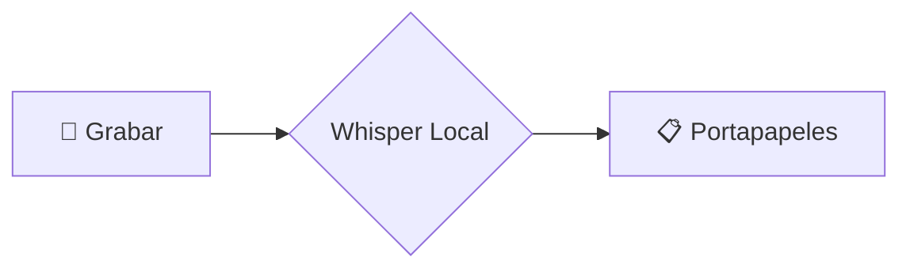
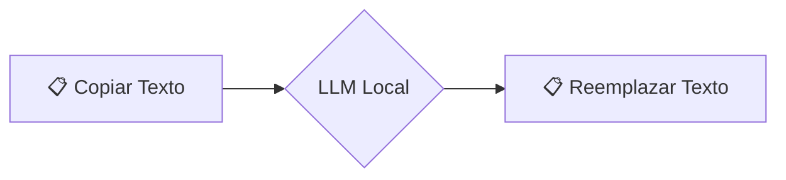

# 🗣️ voice2machine (v2m-lab)

Fuente de verdad interna y núcleo upstream para Voice2Machine.

_dictado por voz para cualquier campo de texto de tu sistema operativo_

---

## 🚀 Exploración

### ¿Qué es esto?
Una herramienta que convierte tu voz en texto usando tu GPU local. La premisa es simple: hablar es más rápido que escribir. Este proyecto te permite dictar en cualquier aplicación sin depender de servicios en la nube.

### ¿Por qué usarlo?
- **Privacidad**: Filosofía local-first. Tu audio nunca sale de tu máquina.
- **Velocidad**: Transcripción acelerada por GPU (Whisper) para rendimiento casi en tiempo real.
- **Flexibilidad**: Funciona con cualquier campo de texto del SO mediante inyección en el portapapeles.

### ¿Para quién?
- **Desarrolladores**: Automatiza documentación y código mediante voz.
- **Escritores**: Redacta contenido a la velocidad del pensamiento.
- **Defensores de la Privacidad**: Usa IA sin capitalismo de vigilancia.

---

## ⚡ Inicio Rápido

### Instalación
Consulta la [Guía de Instalación](docs/docs/es/instalacion.md) para pasos detallados en Ubuntu/Debian.

### Uso
Dos atajos de teclado globales controlan el flujo:

| Script | Función |
| :--- | :--- |
| `v2m-toggle.sh` | **Grabar** → **Transcribir** → **Pegar** (vía portapapeles) |
| `v2m-llm.sh` | **Copiar** → **Refinar** (LLM) → **Reemplazar** |

---

## 📚 Documentación

La documentación técnica detallada está consolidada en el directorio `docs/` (en español) y puede servirse localmente con `mkdocs serve`.

- [**Instalación**](docs/docs/es/instalacion.md): Guía de configuración.
- [**Arquitectura**](docs/docs/es/arquitectura.md): Diseño del sistema.
- [**Configuración**](docs/docs/es/configuracion.md): Ajuste de parámetros.
- [**Atajos de Teclado**](docs/docs/es/atajos_teclado.md): Referencia de control.
- [**Solución de Problemas**](docs/docs/es/troubleshooting.md): Arreglo de problemas comunes.

---

## 🧩 Flujos Visuales

### Voz a Texto (Estándar)

### Texto a Texto Refinado (LLM)

> *Nota: Los diagramas requieren un visor compatible con Mermaid.*

---

## 📄 Licencia

Este proyecto está licenciado bajo la **GNU General Public License v3.0** - ver el archivo [LICENSE](LICENSE) para más detalles.
