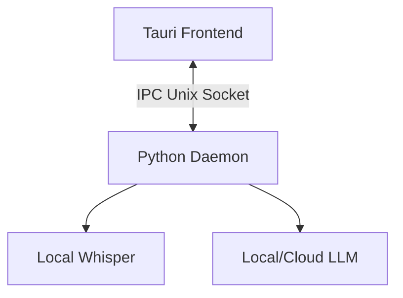

# 🗣️ Voice2Machine (V2M)

> **Local Voice Dictation & Text Refinement**
> *State of the Art 2026 - Privacy First - GPU Accelerated*

---

## 🚀 Overview

**Voice2Machine** allows you to dictate text into **any application** on your operating system. It uses your local GPU to transcribe audio with maximum speed and accuracy, ensuring your data never leaves your machine.

*   **Dictation**: Voice → Text (Whisper)
*   **Refinement**: Text → AI → Better Text (LLM)

---

## 📚 Documentation

We maintain comprehensive documentation in both English and Spanish.

*   🇺🇸 **[English Documentation](docs/docs/en/index.md)**
*   🇪🇸 **[Documentación en Español](docs/docs/es/index.md)**

### Quick Links

| Topic | English | Español |
| :--- | :--- | :--- |
| **Start Here** | [Quick Start](docs/docs/en/quick_start.md) | [Guía Rápida](docs/docs/es/guia_rapida.md) |
| **Setup** | [Installation](docs/docs/en/installation.md) | [Instalación](docs/docs/es/instalacion.md) |
| **Config** | [Configuration](docs/docs/en/configuration.md) | [Configuración](docs/docs/es/configuracion.md) |
| **Design** | [Architecture](docs/docs/en/architecture.md) | [Arquitectura](docs/docs/es/arquitectura.md) |

---

## ⚡ Quick Start

### Installation

```bash
# Clone and install (Ubuntu/Debian)
git clone https://github.com/v2m-lab/voice2machine.git
cd voice2machine
./scripts/install.sh
```

### Usage

1.  **Start the Daemon**: `python -m v2m.main --daemon`
2.  **Toggle Recording**: Run `scripts/v2m-toggle.sh` (Bind this to a key like `Super+V`).

---

## 🧩 Architecture

Voice2Machine follows a **Hexagonal Architecture** with a strict separation between the Python Backend (Core logic) and the Tauri Frontend (GUI).



---

## 📄 License

This project is licensed under the **GNU General Public License v3.0**.
