# 🗣️ voice2machine (v2m-lab)

Internal source of truth and upstream core for Voice2Machine.

_voice dictation for any text field in your operating system_

---

## what is this

A tool that converts your voice to text using your local GPU.

The premise is simple: speaking is faster than typing. This project lets you dictate in any application without relying on cloud services.

---

## philosophy

- **local-first**: your audio never leaves your machine
- **modular**: started as a script, now it's an app with separated responsibilities
- **gpu-powered**: transcription speed using WHISPER locally

---

## how it works

two global keyboard shortcuts:

| script          | function                                        |
| --------------- | ----------------------------------------------- |
| `v2m-toggle.sh` | record → transcribe → copy to clipboard         |
| `v2m-llm.sh`    | take clipboard text → refine with LLM → replace |

---

## documentation

all technical info is in `/docs`:

- [installation](docs/en/installation.md)
- [architecture](docs/en/architecture.md)
- [configuration](docs/en/configuration.md)
- [keyboard shortcuts](docs/atajos_teclado.md) ⌨️
- [troubleshooting](docs/en/troubleshooting.md)

---

## visual flows

### voice → text

```mermaid
flowchart LR
A[🎤 record] --> B{whisper}
B --> C[📋 clipboard]
```

### text → improved text

```mermaid
flowchart LR
A[📋 copy] --> B{LLM}
B --> C[📋 replace]
```

> if you can't see the diagrams, you need a mermaid extension

---

## license

This project is licensed under the **GNU General Public License v3.0** - see the [LICENSE](LICENSE) file for details.
