# 🗣️ voice2machine (v2m-lab)

Internal source of truth and upstream core for Voice2Machine.

_voice dictation for any text field in your OS_

---

## 🚀 Exploration

### What is this?
A tool that converts your voice to text using your local GPU. The premise is simple: speaking is faster than typing. This project allows you to dictate in any application without depending on cloud services.

### Why use it?
- **Privacy**: Local-first philosophy. Your audio never leaves your machine.
- **Speed**: GPU-accelerated transcription (Whisper) for near real-time performance.
- **Flexibility**: Works with any OS text field via clipboard injection.

### For Whom?
- **Developers**: Automate documentation and coding via voice.
- **Writers**: Draft content at the speed of thought.
- **Privacy Advocates**: Use AI without surveillance capitalism.

---

## ⚡ Quick Start

### Installation
See the [Installation Guide](docs/docs/es/instalacion.md) for detailed steps on Ubuntu/Debian.

### Usage
Two global keyboard shortcuts control the flow:

| Script | Function |
| :--- | :--- |
| `v2m-toggle.sh` | **Record** → **Transcribe** → **Paste** (via clipboard) |
| `v2m-llm.sh` | **Copy** → **Refine** (LLM) → **Replace** |

---

## 📚 Documentation

Detailed technical documentation is consolidated in the `docs/` directory (in Spanish) and can be served locally with `mkdocs serve`.

- [**Installation**](docs/docs/es/instalacion.md): Setup guide.
- [**Architecture**](docs/docs/es/arquitectura.md): System design.
- [**Configuration**](docs/docs/es/configuracion.md): Tweak parameters.
- [**Keyboard Shortcuts**](docs/docs/es/atajos_teclado.md): Control reference.
- [**Troubleshooting**](docs/docs/es/troubleshooting.md): Fix common issues.

---

## 🧩 Visual Flows

### Voice to Text (Standard)

```mermaid
flowchart LR
    A[🎤 Record] --> B{Whisper Local}
    B --> C[📋 Clipboard]
```

### Text to Refined Text (LLM)

```mermaid
flowchart LR
    A[📋 Copy Text] --> B{Local LLM}
    B --> C[📋 Replace Text]
```

> *Note: Diagrams require a Mermaid-compatible viewer.*

---

## 📄 License

This project is licensed under the **GNU General Public License v3.0** - see the [LICENSE](LICENSE) file for more details.
