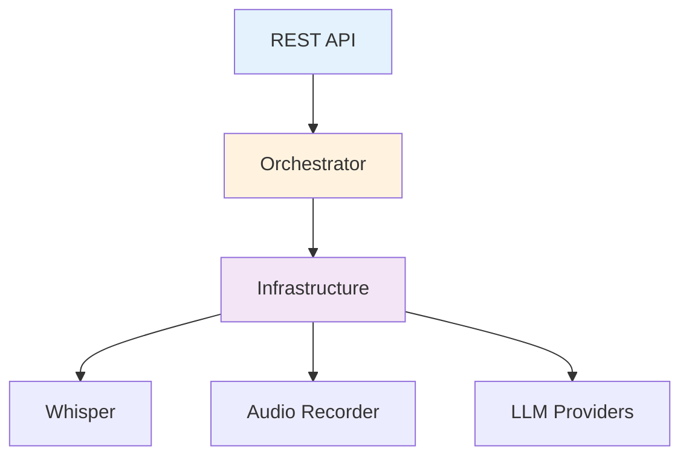

# Backend API (Python)

This section contains documentation automatically generated from the Voice2Machine backend source code.

!!! info "Auto-generated"
This documentation syncs automatically with code docstrings.
Source of truth: `apps/daemon/backend/src/v2m/`

---

## Main Modules

### Coordination Service

- [**Orchestrator**](orchestrator.md) - Central system coordinator
- [**REST API**](api.md) - FastAPI endpoints and data models

### Configuration

- [**Config**](config.md) - Typed configuration system

### Infrastructure

- [**Transcription**](transcription.md) - Whisper and streaming
- [**LLM Services**](llm.md) - Gemini, Ollama, Local

---

## Layer Navigation

| Layer              | Responsibility                            |
| ------------------ | ----------------------------------------- |
| **API**            | HTTP endpoints, validation, serialization |
| **Services**       | Workflow coordination                     |
| **Infrastructure** | External service adapters                 |

---

## Code Status

| Metric             | Value        |
| ------------------ | ------------ |
| Python Files       | 27           |
| Docstring Coverage | ~70%         |
| Style              | Google Style |
