# 🧩 System Architecture

!!! abstract "Technical Philosophy"
**Voice2Machine** implements a strict **Hexagonal Architecture (Ports & Adapters)**, prioritizing decoupling, testability, and technological independence. The system adheres to SOTA 2026 standards like static typing in Python (Protocol) and Frontend/Backend separation via REST API.

---

## 🏗️ High-Level Diagram

```mermaid
graph TD
    subgraph Clients ["🔌 Clients (CLI / Scripts / GUI / Tauri)"]
        ClientApp["Any HTTP Client"]
    end

    subgraph Backend ["🐍 Backend Daemon (Python + FastAPI)"]
        API["FastAPI Server<br>(api.py)"]

        subgraph Hexagon ["Hexagon (Core)"]
            Orchestrator["Orchestrator<br>(Coordination)"]
            Domain["Domain<br>(Interfaces/Models)"]
        end

        subgraph Infra ["Infrastructure (Adapters)"]
            Whisper["Whisper Adapter<br>(faster-whisper)"]
            Audio["Audio Engine<br>(Rust v2m_engine)"]
            LLM["LLM Providers<br>(Gemini/Ollama)"]
        end
    end

    ClientApp <-->|REST + WebSocket| API
    API --> Orchestrator
    Orchestrator --> Domain
    Whisper -.->|Implements| Domain
    Audio -.->|Implements| Domain
    LLM -.->|Implements| Domain

    style Clients fill:#e3f2fd,stroke:#1565c0
    style Backend fill:#e8f5e9,stroke:#2e7d32
    style Hexagon fill:#fff3e0,stroke:#ef6c00
    style Infra fill:#f3e5f5,stroke:#7b1fa2
```



---

## 📦 Backend Components

### 1. API Layer (FastAPI)

Located in `apps/daemon/backend/src/v2m/api.py`.

- **REST Endpoints**: `/toggle`, `/start`, `/stop`, `/status`, `/health`
- **WebSocket**: `/ws/events` for real-time transcription streaming
- **Auto-documentation**: Swagger UI at `/docs`

!!! info "Migration Complete"
The previous system used Unix Domain Sockets with custom binary protocol. Since v0.2.0, we use FastAPI for simplicity and compatibility with any HTTP client.

### 2. Orchestrator (Coordination)

Located in `apps/daemon/backend/src/v2m/services/orchestrator.py`.

The Orchestrator is the central coordination point that:

- Manages the complete lifecycle: recording → transcription → post-processing
- Maintains system state (idle, recording, processing)
- Coordinates communication between adapters without coupling them directly
- Emits events to connected WebSocket clients

```python
class Orchestrator:
    async def toggle(self) -> ToggleResponse: ...
    async def start(self) -> ToggleResponse: ...
    async def stop(self) -> ToggleResponse: ...
    async def warmup(self) -> None: ...
```

### 3. Core (The Hexagon)

Located in `apps/daemon/backend/src/v2m/core/` and `domain/`.

- **Ports (Interfaces)**: Defined using `typing.Protocol` + `@runtime_checkable` for structural checking at runtime
- **Domain Models**: DTOs with Pydantic V2 for automatic validation
- **Strict Contracts**: Adapters implement interfaces, not concrete classes

### 4. Infrastructure (Adapters)

Located in `apps/daemon/backend/src/v2m/infrastructure/`.

| Adapter            | Responsibility                                                 |
| ------------------ | -------------------------------------------------------------- |
| **WhisperAdapter** | Transcription with `faster-whisper`. Lazy loading to save VRAM |
| **AudioRecorder**  | Audio capture using Rust extension (`v2m_engine`)              |
| **LLMProviders**   | Factory for Gemini/Ollama based on configuration               |
| **SystemMonitor**  | Real-time GPU/CPU telemetry                                    |

---

## ⚡ Client-Backend Communication

Voice2Machine uses **FastAPI REST + WebSocket** for communication:

### REST (Synchronous)

```bash
# Toggle recording
curl -X POST http://localhost:8765/toggle | jq

# Check status
curl http://localhost:8765/status | jq
```

### WebSocket (Streaming)

```javascript
const ws = new WebSocket("ws://localhost:8765/ws/events");
ws.onmessage = (e) => {
  const { event, data } = JSON.parse(e.data);
  if (event === "transcription_update") {
    console.log(data.text, data.final);
  }
};
```

---

## 🦀 Native Extensions (Rust)

For critical tasks where Python's GIL is a bottleneck, we use native extensions compiled in Rust (`v2m_engine`):

| Component       | Function                                        |
| --------------- | ----------------------------------------------- |
| **Audio I/O**   | Direct WAV writing to disk (zero-copy)          |
| **VAD**         | Ultra-low latency voice detection (Silero ONNX) |
| **Ring Buffer** | Lock-free circular buffer for real-time audio   |

---

## 🔄 Data Flow


---

## 🛡️ 2026 Design Principles

| Principle                 | Implementation                                                              |
| ------------------------- | --------------------------------------------------------------------------- |
| **Local-First**           | No data leaves the machine unless a cloud provider is explicitly configured |
| **Privacy-By-Design**     | Audio processed in memory, temp files deleted after transcription           |
| **Resilience**            | Automatic error recovery, subsystem restart if they fail                    |
| **Observability**         | Structured logging (OpenTelemetry), real-time metrics                       |
| **Performance is Design** | Async FastAPI, Rust for hot paths, warm model in VRAM                       |
