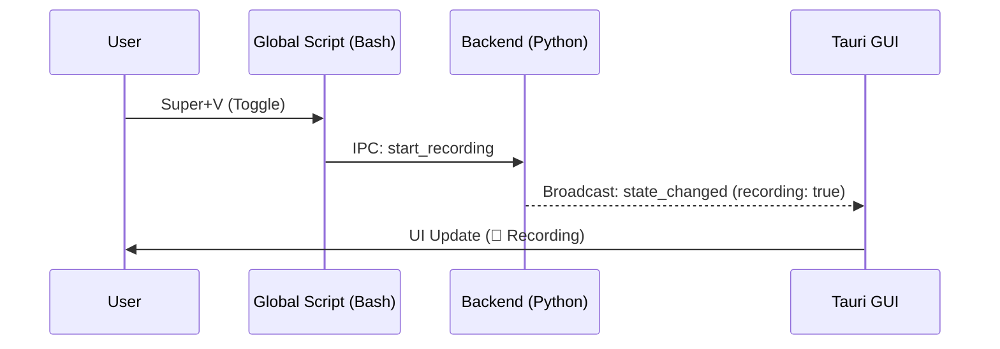

# 🖥️ Architecture and Frontend Guide

!!! abstract "Technology Stack 2026"
    The Voice2Machine frontend is a **Tauri 2.0** application utilizing **React 19** and **TypeScript**. It is designed to be ultra-lightweight (<50MB RAM), reactive, and decoupled from heavy processing (Backend).

---

## 🏗️ Modular Structure

The application is organized into isolated functional components to facilitate maintenance and testing.

### Core Components (`src/components/`)

- **Sidebar**: Main navigation and real-time telemetry display (CPU/GPU).
- **Studio**: Advanced text editor for correction and refinement of transcriptions.
- **SettingsModal**: Configuration panel managed with `react-hook-form` and `zod`.
- **Transcriptions**: Virtualized list of transcription history.

### State Management (Contexts)

We implement a split context architecture to avoid unnecessary re-renders (Performance First):

1.  **`BackendControlContext`**: Handles global connection state, commands (Start/Stop), and configuration.
2.  **`TelemetryContext`**: High-frequency channel dedicated exclusively to metrics (GPU VRAM, Audio Level). This allows updating graphs at 60fps without affecting the rest of the UI.

---

## ⚡ Lifecycle and Events

### Initialization
1.  Tauri app starts (`main.rs`).
2.  React mounts `App.tsx`.
3.  `BackendProvider` attempts to connect to the Daemon's Unix socket.
4.  If connected, it synchronizes initial state (`get_config`, `get_state`).

### Bidirectional Synchronization
The frontend reflects in real-time what happens in the backend (even if the action was initiated by a global keyboard shortcut).



---

## 🛠️ Development

### Key Commands

```bash
# Start development mode (Hot Reload)
npm run tauri dev

# Build optimized binary
npm run tauri build

# Run tests (Vitest)
npm run test
```

### Testing (Vitest + React Testing Library)
Tests are located next to source code (`.spec.tsx`).
- **Unit**: Verify logic of isolated components.
- **Integration**: Verify complete flows (e.g., Settings form validation).

---

## 🎨 UI Style Guide

We use **TailwindCSS** with a consistent design system.

- **Colors**: Neutral palette (`slate`) with semantic accents (`rose` for recording, `emerald` for success).
- **Typography**: Modern sans-serif (Inter/Roboto) optimized for readability.
- **Dark Mode**: First-class native support.

---

## 🐛 Frontend Troubleshooting

### "Waiting for Daemon..."
The UI stays gray or shows a spinner.
*   **Cause**: No connection to the IPC socket.
*   **Solution**: Verify that the backend is running (`python scripts/verify_daemon.py`).

### Frozen graphs
*   **Cause**: `TelemetryContext` lost the data stream.
*   **Solution**: Restart the GUI (`Ctrl+R` in dev mode) or reconnect the backend.
