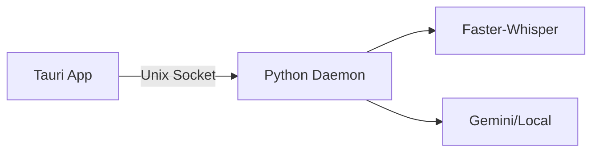

# GRAPHICAL USER INTERFACE (GUI) GUIDE

The **voice2machine** GUI is a native desktop application built with Tauri that provides visual control of the transcription daemon.

---

## PREREQUISITES

Before using the GUI, make sure that:

1. **The v2m daemon is running**:

   ```bash
   # check if it's active
   pgrep -f v2m

   # or start manually
   ./scripts/v2m-daemon.sh start
   ```

2. **Socket available** at `/tmp/v2m.sock`

---

## STARTING THE GUI

### Option 1: From the binary (production)

```bash
./apps/frontend/src-tauri/target/release/voice2machine
```

### Option 2: In development mode

```bash
cd apps/frontend
npm run tauri dev
```

---

## USER INTERFACE

### MAIN ELEMENTS

```
┌─────────────────────────────────────┐
│  🎤 voice2machine      ● Ready      │  ← Header with status
├─────────────────────────────────────┤
│                                     │
│            [ 🎤 ]                   │  ← Main button
│                                     │
├─────────────────────────────────────┤
│                                     │
│   Transcribed text appears here...  │  ← Text area
│                                     │
├─────────────────────────────────────┤
│    [ Copy ]    [ Refine AI ]        │  ← Actions
└─────────────────────────────────────┘
```

### SYSTEM STATES

| Indicator | State               | Meaning                         |
| --------- | ------------------- | ------------------------------- |
| 🟢        | Ready               | System ready to record          |
| 🔴        | Recording...        | Capturing audio from microphone |
| 🔵        | Transcribing...     | Processing audio with Whisper   |
| 🔵        | Refining with AI... | Improving text with LLM         |
| ⚪        | Daemon disconnected | The daemon is not running       |
| 🔴        | Error               | Something failed (see message)  |

---

## USAGE FLOW

1. **Start recording**: Click the microphone button
2. **Speak**: The system shows "Recording..." pulsing
3. **Stop**: Click again to finish
4. **Transcription**: Text appears automatically
5. **Refine (optional)**: Click "Refine AI" to improve the text
6. **Copy**: Click "Copy" to send it to clipboard

---

## KEYBOARD SHORTCUTS

> [!NOTE]
> Global keyboard shortcuts (`Super+V`) work independently of the GUI and control the same daemon. If you activate recording via keyboard, the GUI will automatically reflect the state.

---

## TROUBLESHOOTING

### "Daemon disconnected"

The socket `/tmp/v2m.sock` doesn't exist or the daemon isn't responding.

```bash
# restart the daemon
./scripts/v2m-daemon.sh restart
```

### Button doesn't respond

The system is in "transcribing" or "processing" state. Wait for it to finish.

### No audio

Verify that the microphone is correctly configured in the system.

---

## TECHNICAL ARCHITECTURE

The GUI is a **client** of the Python daemon. It contains no AI logic.



This guarantees:

- **Zero overhead**: The GUI doesn't affect inference performance
- **Synchronization**: Multiple clients (GUI, scripts) share the same state
- **Minimal footprint**: ~13MB, <50MB RAM
