# 🕹️ Quick Start Guide

!!! abstract "Executive Summary"
    Voice2Machine has two superpowers: **Dictation** (Voice → Text) and **Refinement** (Text → Better Text).

This visual guide helps you understand the main workflows so you can be productive in minutes.

---

## 1. Dictation Flow (Voice → Text)

*Ideal for: Writing emails, code, or quick messages without touching the keyboard.*

1.  **Focus**: Click on the text field where you want to write.
2.  **Activate Shortcut** (Configurable, defaults to running `v2m-toggle.sh`). You will hear a start sound 🔔.
3.  **Speak** clearly. Don't worry about being a robot, speak naturally.
4.  **Press Shortcut Again** to stop. You will hear an end sound 🔕.
5.  The text will be **automatically pasted** into your active field (or remain in the clipboard if auto-typing is disabled).

```mermaid
flowchart LR
    A((🎤 START)) -->|Record| B{Local Whisper}
    B -->|Transcribe| C[📋 Clipboard / Paste]

    style A fill:#ff6b6b,stroke:#333,stroke-width:2px,color:white
    style B fill:#feca57,stroke:#333,stroke-width:2px
    style C fill:#48dbfb,stroke:#333,stroke-width:2px
```

---

## 2. Refinement Flow (Text → AI → Text)

*Ideal for: Correcting grammar, translating, or professionally formatting a rough draft.*

1.  **Select and Copy** (`Ctrl + C`) the text you want to improve.
2.  **Activate AI Shortcut** (running `v2m-llm.sh`).
3.  Wait a few seconds (the AI is thinking 🧠).
4.  The improved text will **replace** your clipboard content.
5.  **Paste** (`Ctrl + V`) the result.

```mermaid
flowchart LR
    A[📋 Original Text] -->|Copy| B((🧠 AI SHORTCUT))
    B -->|Process| C{Local LLM / Gemini}
    C -->|Improve| D[✨ Polished Text]

    style A fill:#c8d6e5,stroke:#333,stroke-width:2px
    style B fill:#5f27cd,stroke:#333,stroke-width:2px,color:white
    style C fill:#feca57,stroke:#333,stroke-width:2px
    style D fill:#1dd1a1,stroke:#333,stroke-width:2px
```

---

## 💡 Pro Tips

!!! tip "Improve Your Accuracy"
    - **Speak Fluidly**: Whisper understands context better in complete sentences than isolated words.
    - **Hardware**: A noise-canceling microphone drastically improves results.
    - **Configuration**: You can adjust the LLM "temperature" in settings to make it more creative or more literal.

!!! success "Privacy Guaranteed"
    **Dictation** is 100% local (running on your GPU). **Refinement** can be local (Ollama) or cloud (Gemini); you have total control in the configuration.
