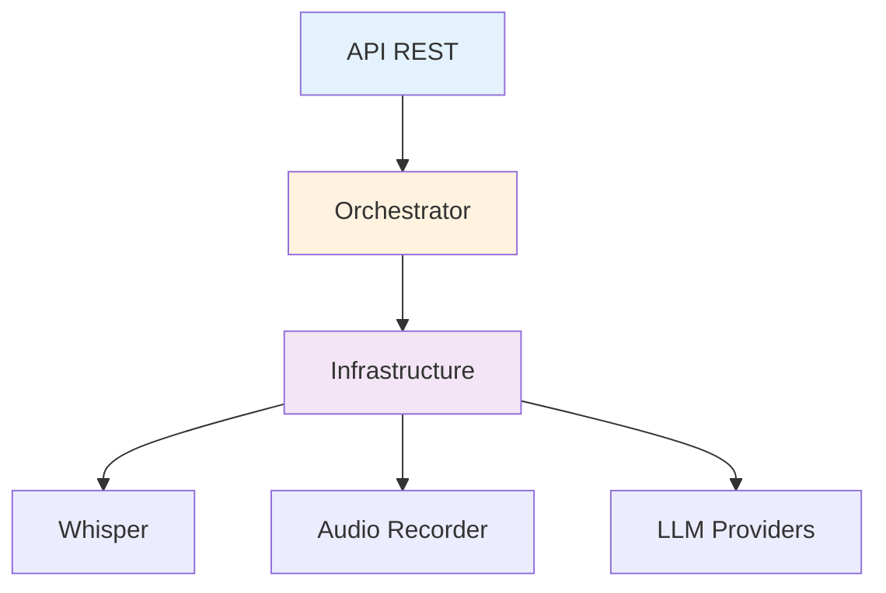

# API Backend (Python)

Esta sección contiene documentación generada automáticamente desde el código fuente del backend de Voice2Machine.

!!! info "Auto-generada"
Esta documentación se sincroniza automáticamente con los docstrings del código.
La fuente de verdad es: `apps/daemon/backend/src/v2m/`

---

## Módulos Principales

### Servicio de Coordinación

- [**Orchestrator**](orchestrator.md) - Coordinador central del sistema
- [**API REST**](api.md) - Endpoints FastAPI y modelos de datos

### Configuración

- [**Config**](config.md) - Sistema de configuración tipada

### Infraestructura

- [**Transcripción**](transcription.md) - Whisper y streaming
- [**LLM Services**](llm.md) - Gemini, Ollama, Local

---

## Navegación por Capas

| Capa               | Responsabilidad                           |
| ------------------ | ----------------------------------------- |
| **API**            | Endpoints HTTP, validación, serialización |
| **Services**       | Coordinación de flujo de trabajo          |
| **Infrastructure** | Adaptadores a servicios externos          |

---

## Estado del Código

| Métrica              | Valor        |
| -------------------- | ------------ |
| Archivos Python      | 27           |
| Cobertura docstrings | ~70%         |
| Estilo               | Google Style |
