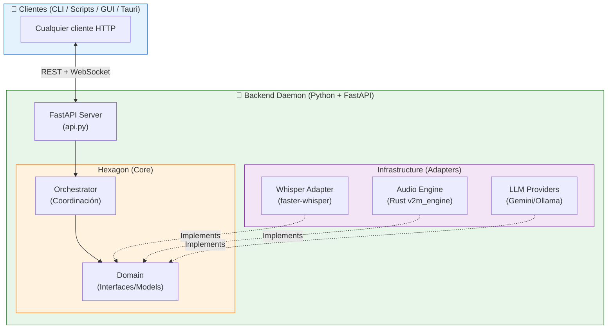
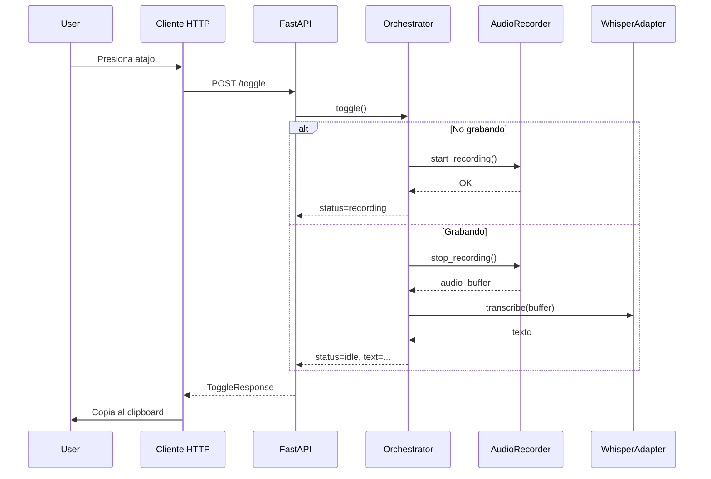

# 🧩 Arquitectura del Sistema

!!! abstract "Filosofía Técnica"
**Voice2Machine** implementa una **Arquitectura Hexagonal (Ports & Adapters)** estricta, priorizando el desacoplamiento, la testabilidad y la independencia tecnológica. El sistema se adhiere a estándares SOTA 2026 como tipos estáticos en Python (Protocol) y separación Frontend/Backend mediante API REST.

---

## 🏗️ Diagrama de Alto Nivel



---

## 📦 Componentes del Backend

### 1. API Layer (FastAPI)

Ubicado en `apps/daemon/backend/src/v2m/api.py`.

- **Endpoints REST**: `/toggle`, `/start`, `/stop`, `/status`, `/health`
- **WebSocket**: `/ws/events` para streaming de transcripción en tiempo real
- **Documentación automática**: Swagger UI en `/docs`

!!! info "Migración Completada"
El sistema anterior usaba Unix Domain Sockets con protocolo binario personalizado. Desde v0.2.0, usamos FastAPI para simplicidad y compatibilidad con cualquier cliente HTTP.

### 2. Orchestrator (Coordinación)

Ubicado en `apps/daemon/backend/src/v2m/services/orchestrator.py`.

El Orchestrator es el punto central de coordinación que:

- Gestiona el ciclo de vida completo: grabación → transcripción → post-procesamiento
- Mantiene el estado del sistema (idle, recording, processing)
- Coordina la comunicación entre adaptadores sin acoplarlos directamente
- Emite eventos a clientes WebSocket conectados

```python
class Orchestrator:
    async def toggle(self) -> ToggleResponse: ...
    async def start(self) -> ToggleResponse: ...
    async def stop(self) -> ToggleResponse: ...
    async def warmup(self) -> None: ...
```

### 3. Core (El Hexágono)

Ubicado en `apps/daemon/backend/src/v2m/core/` y `domain/`.

- **Puertos (Interfaces)**: Definidos usando `typing.Protocol` + `@runtime_checkable` para chequeo estructural en tiempo de ejecución
- **Modelos de Dominio**: DTOs con Pydantic V2 para validación automática
- **Contratos estrictos**: Los adaptadores implementan interfaces, no clases concretas

### 4. Infrastructure (Adapters)

Ubicado en `apps/daemon/backend/src/v2m/infrastructure/`.

| Adapter            | Responsabilidad                                                    |
| ------------------ | ------------------------------------------------------------------ |
| **WhisperAdapter** | Transcripción con `faster-whisper`. Lazy loading para ahorrar VRAM |
| **AudioRecorder**  | Captura de audio usando extensión Rust (`v2m_engine`)              |
| **LLMProviders**   | Factory para Gemini/Ollama según configuración                     |
| **SystemMonitor**  | Telemetría de GPU/CPU en tiempo real                               |

---

## ⚡ Comunicación Cliente-Backend

Voice2Machine utiliza **FastAPI REST + WebSocket** para la comunicación:

### REST (Síncrono)

```bash
# Toggle grabación
curl -X POST http://localhost:8765/toggle | jq

# Verificar estado
curl http://localhost:8765/status | jq
```

### WebSocket (Streaming)

```javascript
const ws = new WebSocket("ws://localhost:8765/ws/events");
ws.onmessage = (e) => {
  const { event, data } = JSON.parse(e.data);
  if (event === "transcription_update") {
    console.log(data.text, data.final);
  }
};
```

---

## 🦀 Extensiones Nativas (Rust)

Para tareas críticas donde el GIL de Python es un cuello de botella, utilizamos extensiones nativas compiladas en Rust (`v2m_engine`):

| Componente      | Función                                               |
| --------------- | ----------------------------------------------------- |
| **Audio I/O**   | Escritura de WAVs directa a disco (zero-copy)         |
| **VAD**         | Detección de voz de ultra-baja latencia (Silero ONNX) |
| **Buffer Ring** | Buffer circular lock-free para audio en tiempo real   |

---

## 🔄 Flujo de Datos



---

## 🛡️ Principios de Diseño 2026

| Principio                 | Implementación                                                                            |
| ------------------------- | ----------------------------------------------------------------------------------------- |
| **Local-First**           | Ningún dato sale de la máquina a menos que se configure explícitamente un proveedor cloud |
| **Privacy-By-Design**     | Audio procesado en memoria, archivos temporales eliminados después de transcripción       |
| **Resiliencia**           | Recuperación automática de errores, reinicio de subsistemas si fallan                     |
| **Observabilidad**        | Logging estructurado (OpenTelemetry), métricas en tiempo real                             |
| **Performance is Design** | FastAPI async, Rust para hot paths, modelo warm en VRAM                                   |
