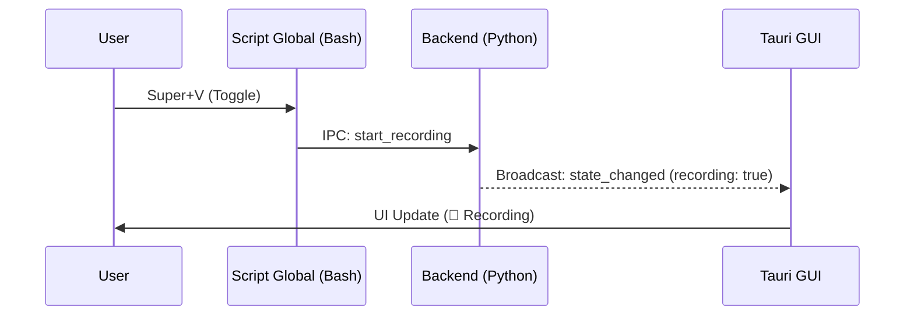

# 🖥️ Arquitectura y Guía Frontend

!!! abstract "Stack Tecnológico 2026"
    El frontend de Voice2Machine es una aplicación **Tauri 2.0** que utiliza **React 19** y **TypeScript**. Está diseñado para ser ultraligero (<50MB RAM), reactivo y desacoplado del procesamiento pesado (Backend).

---

## 🏗️ Estructura Modular

La aplicación se organiza en componentes funcionales aislados para facilitar el mantenimiento y testing.

### Componentes Core (`src/components/`)

- **Sidebar**: Navegación principal y visualización de telemetría (CPU/GPU) en tiempo real.
- **Studio**: Editor de texto avanzado para corrección y refinado de transcripciones.
- **SettingsModal**: Panel de configuración gestionado con `react-hook-form` y `zod`.
- **Transcriptions**: Lista virtualizada de historial de transcripciones.

### Gestión de Estado (Contexts)

Implementamos una arquitectura de contextos dividida para evitar re-renders innecesarios (Performance First):

1.  **`BackendControlContext`**: Maneja el estado global de conexión, comandos (Start/Stop) y configuración.
2.  **`TelemetryContext`**: Canal de alta frecuencia dedicado exclusivamente a métricas (GPU VRAM, Audio Level). Esto permite actualizar gráficas a 60fps sin afectar al resto de la UI.

---

## ⚡ Ciclo de Vida y Eventos

### Inicialización
1.  La app Tauri arranca (`main.rs`).
2.  React monta `App.tsx`.
3.  `BackendProvider` intenta conectar al socket Unix del Daemon.
4.  Si conecta, sincroniza el estado inicial (`get_config`, `get_state`).

### Sincronización Bidireccional
El frontend refleja en tiempo real lo que ocurre en el backend (incluso si la acción fue iniciada por un atajo de teclado global).



---

## 🛠️ Desarrollo

### Comandos Clave

```bash
# Iniciar modo desarrollo (Hot Reload)
npm run tauri dev

# Construir binario optimizado
npm run tauri build

# Ejecutar tests (Vitest)
npm run test
```

### Testing (Vitest + React Testing Library)
Los tests se ubican junto al código fuente (`.spec.tsx`).
- **Unitarios**: Verifican lógica de componentes aislados.
- **Integración**: Verifican flujos completos (ej. Settings form validation).

---

## 🎨 Guía de Estilo UI

Utilizamos **TailwindCSS** con un sistema de diseño consistente.

- **Colores**: Paleta neutra (`slate`) con acentos semánticos (`rose` para grabación, `emerald` para éxito).
- **Tipografía**: Sans-serif moderna (Inter/Roboto) optimizada para legibilidad.
- **Modo Oscuro**: Soporte nativo de primera clase.

---

## 🐛 Troubleshooting Frontend

### "Waiting for Daemon..."
La UI se queda en gris o mostrando un spinner.
*   **Causa**: No hay conexión al socket IPC.
*   **Solución**: Verifica que el backend corre (`python scripts/verify_daemon.py`).

### Gráficas congeladas
*   **Causa**: El `TelemetryContext` perdió el flujo de datos.
*   **Solución**: Reinicia la GUI (`Ctrl+R` en modo dev) o reconecta el backend.
