# 🧩 System Architecture

**Voice2Machine** is designed following **Hexagonal Architecture (Ports and Adapters)** and **CQRS (Command Query Responsibility Segregation)** principles. This ensures low coupling between business logic and infrastructure details (such as the audio library or LLM provider).

---

## High-Level Diagram

The following diagram illustrates the data flow and separation of responsibilities between system layers.

```mermaid
graph TD
    subgraph Client ["🖥️ Client / Input"]
        CLI("CLI / Scripts<br>(main.py)")
        GUI("GUI App<br>(Tauri + React)")
        Shortcuts("Keyboard Shortcuts")
    end

    subgraph Application ["🧠 Application Layer"]
        Bus("Command Bus")
        Handlers("Command Handlers<br>(Business Logic)")
    end

    subgraph Domain ["💎 Domain Layer"]
        Interfaces("Interfaces<br>(Ports)")
        Entities("Entities and Errors")
    end

    subgraph Infrastructure ["🔌 Infrastructure Layer"]
        Whisper("Whisper Service<br>(faster-whisper)")
        Gemini("LLM Service<br>(Google Gemini)")
        Audio("Audio Recorder<br>(sounddevice)")
        System("System Adapters<br>(xclip, notify-send)")
    end

    Shortcuts --> CLI
    GUI -. "Socket IPC" .-> CLI
    CLI -- "Sends Commands" --> Bus
    Bus -- "Dispatches to" --> Handlers
    Handlers -- "Uses Interfaces" --> Interfaces
    Whisper -.-> |Implements| Interfaces
    Gemini -.-> |Implements| Interfaces
    Audio -.-> |Implements| Interfaces
    System -.-> |Implements| Interfaces

    Handlers -- "Invokes" --> Infrastructure

    style Client fill:#e1f5fe,stroke:#01579b
    style Application fill:#fff3e0,stroke:#e65100
    style Domain fill:#f3e5f5,stroke:#4a148c
    style Infrastructure fill:#e8f5e9,stroke:#1b5e20
```

---

## Main Components

### 1. Input Layer (Client & GUI)
System entry points. Contain no business logic, only user intent.

*   **`main.py` (Daemon)**: The persistent brain. Runs as a server listening for commands.
*   **Bash Scripts**: Lightweight shortcuts (`v2m-toggle.sh`) that signal the daemon.
*   **Tauri GUI**: Desktop app (Rust + React) acting as a visual "remote control", communicating via Unix sockets.

### 2. Application Layer
Orchestrates operations.

*   **Command Bus**: Receives DTOs (Data Transfer Objects) like `StartRecordingCommand` and routes them.
*   **Handlers**: Execute pure use cases (e.g., "Start recording", "Process text").

### 3. Domain Layer
The agnostic core. Immutable rules live here.

*   **Interfaces**: Strict contracts (e.g., `TranscriptionService`) forcing infrastructure compliance.
*   **Entities**: Value objects and business state.

### 4. Infrastructure Layer
Concrete implementation ("the real world").

*   **WhisperService**: Optimized wrapper for `faster-whisper` with VRAM management.
*   **GeminiLLMService**: Client for Google AI Studio API.
*   **LinuxAdapters**: Native integration with `DBus` and `X11/Wayland` (clipboard).

---

## Key Design Patterns (2026 Standards)

*   **Dependency Injection (DI)**: All components receive dependencies, enabling easy unit testing (mocking) and tech swaps (e.g., switching Gemini for OpenAI without touching domain).
*   **Model Singletons**: Heavy models (Whisper) are kept "hot" in VRAM within the Daemon process, eliminating *cold starts*.
*   **Non-blocking Async**: Core uses `asyncio` to handle I/O (recording, network) without freezing the interface.
