# 🕹️ QUICK START GUIDE

> **Executive Summary**: Voice2Machine has two superpowers: **Dictation** (Voice → Text) and **Refinement** (Text → Better Text).

This visual guide helps you understand the main workflows.

---

## 1. Dictation Flow (Voice → Text)

_Ideal for: Writing emails, code, or quick messages without touching the keyboard._

1.  **Activate the shortcut** (e.g., `Super + V`). You'll hear a start sound 🔔.
2.  **Speak** clearly.
3.  **Press the shortcut again** to stop. You'll hear an end sound 🔕.
4.  The text will magically appear in your **clipboard** (ready to paste `Ctrl + V`).

```mermaid
%%{init: {"flowchart": {"htmlLabels": false}} }%%
flowchart LR
    A((🎤 START)) -->|Record| B{Local Whisper}
    B -->|Transcribe| C[📋 Clipboard]

    style A fill:#ff6b6b,stroke:#333,stroke-width:2px,color:white
    style B fill:#feca57,stroke:#333,stroke-width:2px
    style C fill:#48dbfb,stroke:#333,stroke-width:2px
```

---

## 2. Refinement Flow (Text → AI → Text)

_Ideal for: Correcting grammar, translating, or giving professional format to a draft._

1.  **Copy some text** (`Ctrl + C`).
2.  **Activate the AI shortcut** (e.g., `Super + G`).
3.  Wait a few seconds (the AI is thinking 🧠).
4.  The improved text **replaces** what you had in the clipboard. Paste it!

```mermaid
%%{init: {"flowchart": {"htmlLabels": false}} }%%
flowchart LR
    A[📋 Original Text] -->|Copy| B((🧠 AI SHORTCUT))
    B -->|Process| C{Gemini / LLM}
    C -->|Improve| D[✨ Polished Text]

    style A fill:#c8d6e5,stroke:#333,stroke-width:2px
    style B fill:#5f27cd,stroke:#333,stroke-width:2px,color:white
    style C fill:#feca57,stroke:#333,stroke-width:2px
    style D fill:#1dd1a1,stroke:#333,stroke-width:2px
```

---

## 💡 Pro Tips

- **Speak fluently**: Whisper understands complete phrases better than isolated words.
- **Microphone**: A good microphone drastically improves accuracy.
- **Privacy**: Remember that **Dictation** is 100% local. **Refinement** uses the cloud (Google Gemini) only if you activate it.
